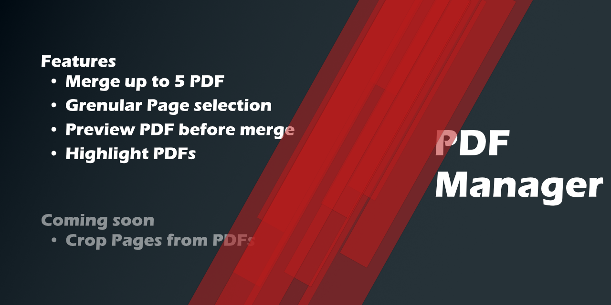

A small Application with the purpose to enhance my daily-office-work. The Application provides functionalities
to merge multiple PDFs. Multiple interactions with each PDF are possible e.g. specifying
the range of Pages who should be included in the final PDF.
The final PDF can be previewed.

# Functionality

<table border="10" frame="hsides">
  <tr>
  <td width="50%" align="center">

  

  </td>
  <td>
  <ul>
  <li>Select up to 5 PDFs.</li>
  <li>Control your current selection through a preview of the final PDF.</li>
  <li>Merge multiple PDFs together.</li>
  </ul>
  </td>
  </tr>

  <tr>
  <td width="50%" align="center">

  </td>
  <td>
  <ul>
  <li>Granular definition of the pages who should be included.</li>
  <li>Delete or switch the currently selected PDF</li>
  <li>Highlight the Pages of the currently selected PDF in the Preview-Window</li>
  </ul>
  </td>
  </tr>
</table>

# Technologie

The Application was build with Spring Boot, JavaFX and the library PDFBox.
The Spring Boot project included its core module, as also the dependency Lombok.
The components were created with the help of JavaFX and its additional library ControlsFX.
Due to incompatibilities between ControlsFX and SceneBuilder were all components written and styled through code. FXML was not used.
Lastly was the library PDFBox from Apache used to read, alter and save the PDF(s).

# Future Improvements

The future progress for the project can be divided into two parts. Work that could be done to improve the current state,
as well as new features.

## Needs to be done
- Adding tests
- Make page selection possible through the textfield in the PDF-Information-Page
- Disable highlight of PDFs
- Disable merge functionality when no PDFs are selected

## New possible Features
- Delete pages of a pdf
- Show Page information for preview-images
    - Show the current page number of the final PDF
    - Show the page number of its initial PDF
- Information-dialogs to give errors/passed warnings for operations
- Identifier how many pages the end-pdf will have

    
# References

- Spring Boot and JavaFX setup:
  
  https://spring.io/blog/2019/01/16/spring-tips-javafx

- ControlsFX:

  https://controlsfx.github.io/

- JavaFX Styleguide:

  https://docs.oracle.com/javase/8/javafx/api/javafx/scene/doc-files/cssref.html

- PDFBox Documentation:

  https://pdfbox.apache.org/2.0/getting-started.html

- Color-Palette-Generator:

  https://m2.material.io/resources/color/#!/?view.left=0&view.right=0

- Readme:

  https://www.adobe.com/de/express/
