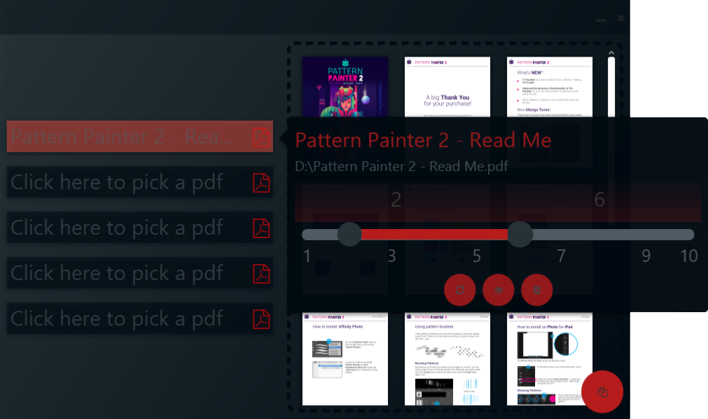

A small application for merging multiple PDFs.
Various functions, such as specifying the pages included in the output PDF, have been implemented
with the aim of improving its usability. A preview of the final PDF can be viewed at any time.

# Functionality

<table border="10" frame="hsides">
  <tr>
  <td width="50%" align="center">

  

  </td>
  <td>
  <ul>
  <li>Select up to 5 PDFs.</li>
  <li>Control your current selection through a preview of the final PDF.</li>
  <li>Merge multiple PDFs together.</li>
  </ul>
  </td>
  </tr>

  <tr>
  <td width="50%" align="center">

  </td>
  <td>
  <ul>
  <li>Granular definition of the pages who should be included.</li>
  <li>Delete or switch the currently selected PDF</li>
  <li>Highlight the Pages of the currently selected PDF in the preview window</li>
  </ul>
  </td>
  </tr>
</table>

# Technologie

The application was built using Spring Boot, JavaFX and PDFBox.
The Spring Boot project included its core module, as well as the Lombok dependency.
The components were created using JavaFX and its add-on library ControlsFX.
Due to incompatibilities between ControlsFX and SceneBuilder, all components were written and styled by code. FXML was not used.

# Future Improvements

Future progress on the project can be divided into two areas. Work that could be done to improve the current state,
and new features.

## Needs to be done
- Adding tests
- Make page selection possible through the textfield in the PDF-Information-Page
- Disable highlight of PDFs
- Disable merge functionality when no PDFs are selected

## New possible Features
- Delete pages of a pdf
- Show Page information for preview-images
    - Show the current page number of the final PDF
    - Show the page number of its initial PDF
- Information-dialogs to give errors/passed warnings for operations
- Identifier how many pages the end-pdf will have

    
# References

- Spring Boot and JavaFX setup:
  
  https://spring.io/blog/2019/01/16/spring-tips-javafx

- ControlsFX:

  https://controlsfx.github.io/

- JavaFX Styleguide:

  https://docs.oracle.com/javase/8/javafx/api/javafx/scene/doc-files/cssref.html

- PDFBox Documentation:

  https://pdfbox.apache.org/2.0/getting-started.html

- Color-Palette-Generator:

  https://m2.material.io/resources/color/#!/?view.left=0&view.right=0

- Readme:

  https://www.adobe.com/de/express/
